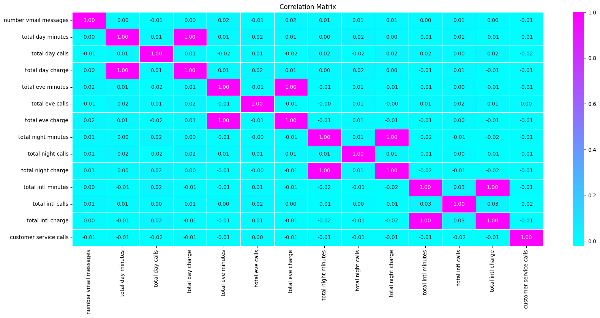
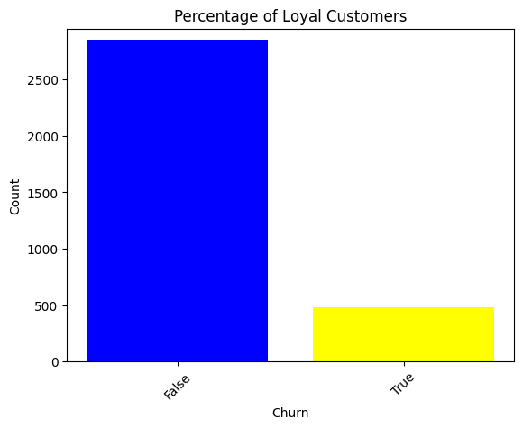
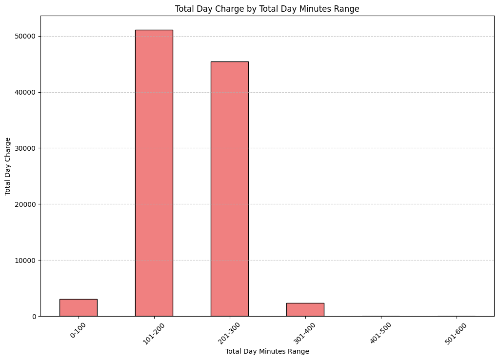
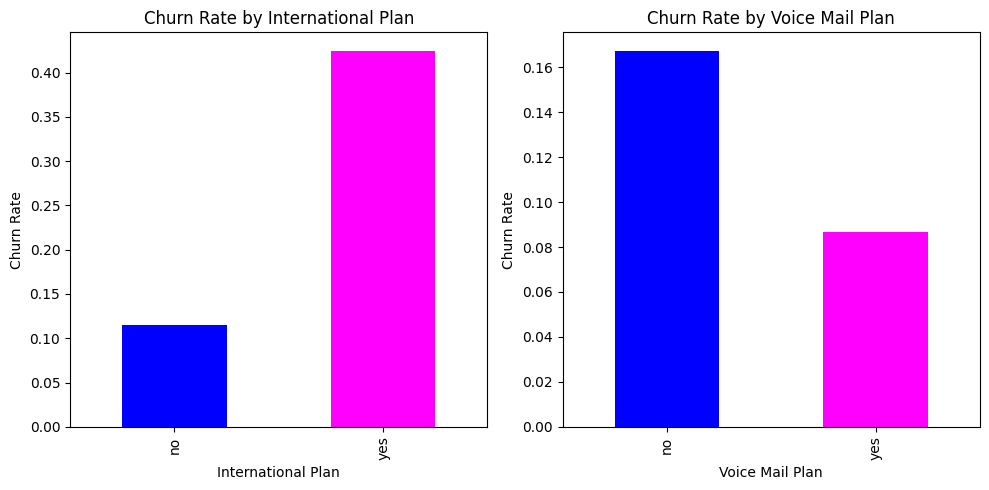
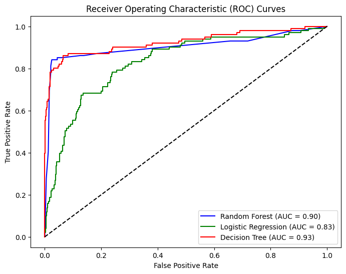

## CUSTOMER CHURN PREDICTION OF SYRIATEL COMPANY
 
### Overview
SyriaTel is addressing customer churn in the competitive telecommunication industry by developing machine learning models to predict churn based on customer data such as demographics and usage patterns. The objectives include building and evaluating these models to identify the most accurate predictor, analyzing key features impacting churn rates, and providing actionable recommendations to enhance customer retention. Additionally, the company aims to refine its retention strategies and continuously adapt its predictive models to stay aligned with changing customer behaviors and market conditions, ultimately reducing churn and improving profitability.
### Business Understanding
In the competitive telecom industry, predicting customer churn is vital for SyriaTel to maintain its edge. Retaining existing customers is more cost-effective than acquiring new ones, making it crucial to prevent churn and improve retention. By analyzing customer demographics, usage patterns, and other data points, SyriaTel can build predictive models to forecast churn and take proactive retention measures. To stay ahead, SyriaTel must continually update these models to reflect changing customer behaviors and market dynamics, ensuring effective retention strategies and sustained competitive advantage.
### Objectives 
1. Develop Predictive Models: Create machine learning models to predict customer churn using data on customer features, such as demographics and usage patterns.
2. Evaluate Model Accuracy: Compare the performance of different machine learning models to determine the most accurate one for predicting customer churn.
3. Feature Impact Analysis: Identify key features that significantly impact customer churn rates to understand the factors driving customer retention and attrition.
4. Provide Actionable Recommendations: Offer strategic recommendations based on the analysis to help SyriaTel implement effective retention strategies and reduce churn rates.
5. Optimize Retention Strategies: Utilize the predictive insights to refine and optimize customer retention strategies, ensuring they align with identified churn predictors and changing customer behaviors.
## Data Understanding 
The project utilizes historical customer data, including demographic information and transactional data of Seriatel telecom company. This data is used to build a predictive model that can classify customers as churned or non-churned. The data has 3333 rows and 21 columns and the company is based in California USA. The colunmn tites are as follows:

- State: The state where the customer resides.
- Area code: The area code associated with the customer's phone number.
- International plan: A binary variable indicating whether the customer has an international calling plan (1) or not (0).
- Voice mail plan: A binary variable indicating whether the customer has a voicemail plan (1) or not (0).
- Number vmail messages: The number of voicemail messages the customer has.
- Total day minutes: The total number of minutes the customer used during the daytime.
- Total day calls: The total number of calls the customer made or received during the daytime.
- Total day charge: The total charges incurred by the customer for daytime usage.
- Total eve minutes: The total number of minutes the customer used during the evening.
- Total eve calls: The total number of calls the customer made or received during the evening.
- Total eve charge: The total charges incurred by the customer for evening usage.
- Total night minutes: The total number of minutes the customer used during the night.
- Total night calls: The total number of calls the customer made or received during the night.
- Total night charge: The total charges incurred by the customer for night usage.
- Total intl minutes: The total number of minutes the customer used for international calls.
- Total intl calls**: The total number of international calls the customer made.
- Total intl charge: The total charges incurred by the customer for international calls.
- Customer service calls: The number of customer service calls made by the customer.
- Churn: A binary variable indicating whether the customer has churned (1) or not (0).
- Total_calls: The total number of calls made or received by the customer across all periods (day, evening, and night).
- Total_charge: The total charges incurred by the customer across all usage periods.
## Data Processing 
- We checked for missing values, duplicates, categorical and numerical values to ensure that data is clean and in correct formaat for modelling.
- We further removed the class imbalance from the data and standardize to make date Consistent and uniformity of modelling.
- This was done to ensured that the data is valid,accurate and complete for modelling. 
- The chart shows heatmap for feature selection and relatuionship understanding.
 
## Exploratory Data Understanding 
We visualized several columns on churn rates, voice mail and internation plan relationship with churn and calls made in United States to get more insights about our data.
### Univariate Analysis 
 
- The pie chart reveals that 90.3% of customers do not have an international plan, indicating its low popularity among SyriaTel’s customer base. 
 
- There is higher percentage of customers not to churn, indicating good customer retention.
### Bivariate Analysis 
 
- `Highest Charges`: The `101-200 minute range` has the highest total day charges, indicating it's the most common usage category.
- `Lower Charges`: The `0-100 minute range` has the lowest total day charges, while charges for usage above `401 minutes` decrease, likely due to pricing strategies or caps.
 
- `Voice Mail Plan`: Lower churn rate indicates higher customer loyalty.
- `International Plan`: Higher churn rate suggests dissatisfaction and a greater likelihood of switching.
- `Customer Preference`: The Voice Mail plan is preferred over the International Plan due to lower churn and higher satisfaction.
## Modelling and Evaluation 
Here we build three models used for predicting customer churn in Seriatel company. The three models are
- `Logistic Regression`: Training and testing accuracy of `76.1%` to `77.1%`, with no significant improvement after `5-fold cross-validation.`

- `Decision Tree`: Achieved a training accuracy of `89.2%` and testing accuracy of `93.4%.` It provided the best overall performance, including F1 score, recall, and precision, after hyperparameter tuning.

- `Random Forest`: Showed a training accuracy of `87.5%` and testing accuracy of `87.9%.` Although it performed well, it exhibited some overfitting compared to the Decision Tree.

- The `Decision Tree model` is the most effective for predicting customer churn, outperforming both Logistic Regression and Random Forest in accuracy and other metrics.
- This can be illustrated in the ROC curve shown below 
 
## Conclusion 
1. `Enhanced Retention`: Accurately predicts churn, allowing Syriatel to implement targeted strategies to retain customers.
2. `Cost Savings`: Optimizes resource allocation by focusing efforts on high-risk customers, reducing unnecessary expenses.
3. `Informed Decisions`: Provides actionable insights for strategic decision-making aligned with customer needs and business objectives.
4. `Better Customer Experience`: Identifies churn factors, enabling improvements in service and customer interactions for increased satisfaction.
## Recommendation 
- `Targeted Retention`: Use the model to identify at-risk customers and create personalized retention strategies.
- `Resource Optimization`: Allocate resources to high-risk customers for cost-effective retention.
- `Improve Experience`: Address churn factors to enhance customer satisfaction and loyalty.
- `Data-Driven Strategy`: Utilize insights for informed decisions on product and market strategies.

